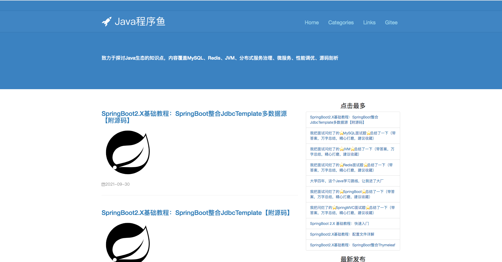
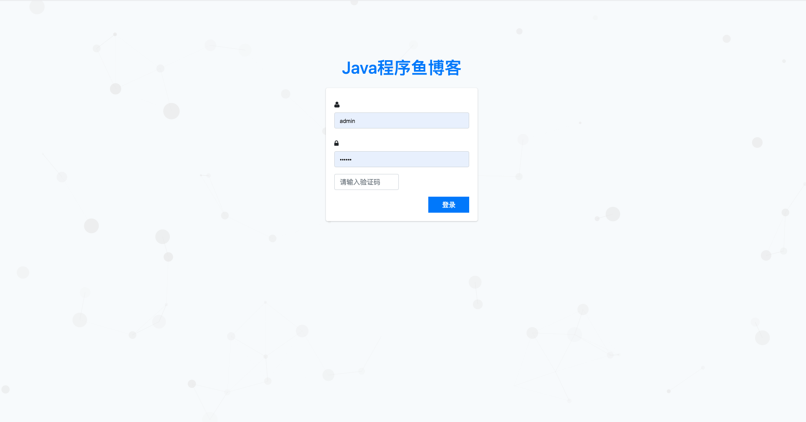
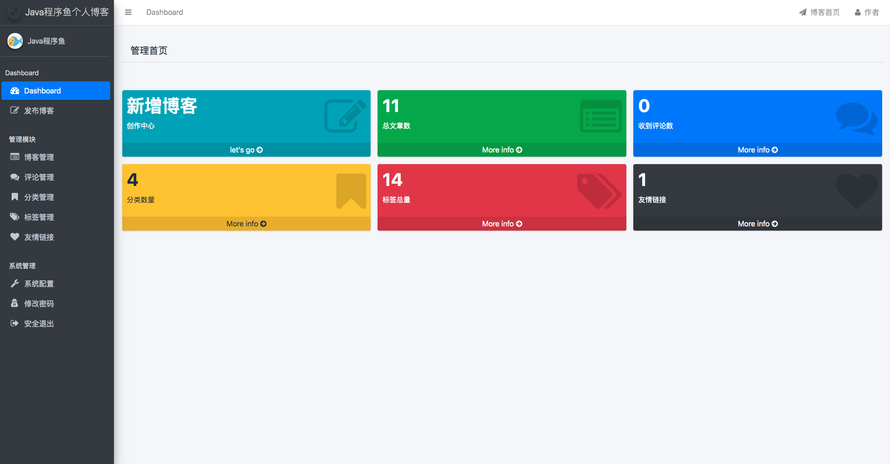
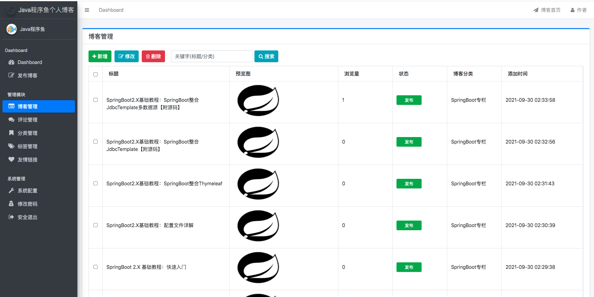
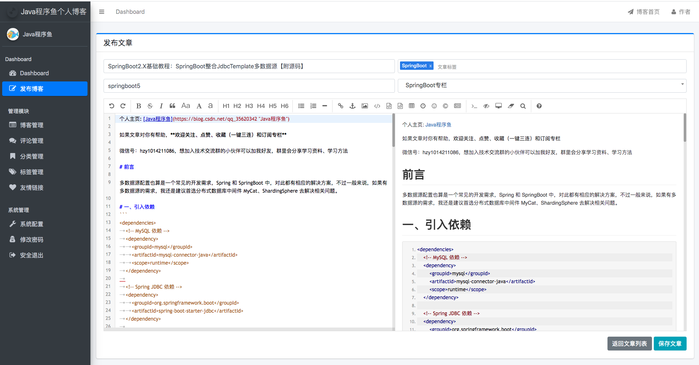
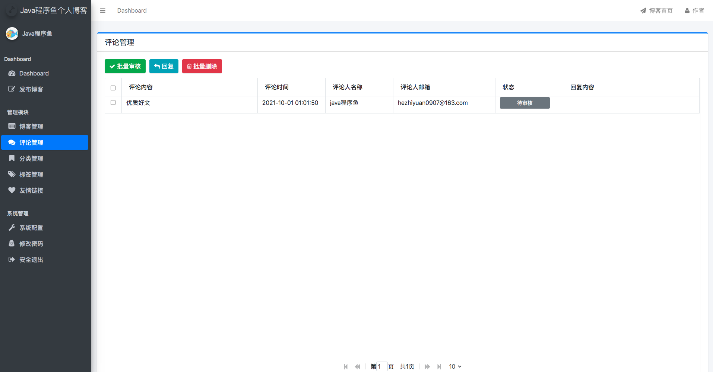
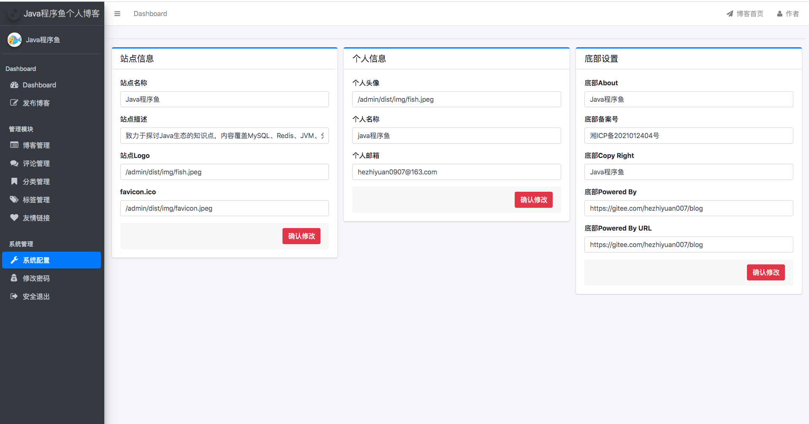

# Java程序鱼博客




**创作不易，各位朋友如果觉得项目对你有帮助的话可以给项目一个 star 吧，也是对我一直更新代码的一种鼓励啦，谢谢各位的支持。**


# 适合人群
<font color="FF0500"><b>「在校学习Java开发的学生 」</b></font>
<font color="2290ff"><b>「 要做毕业设计的大学生 」</b></font>
<font color="13ae01"><b>「 准备面试的求职者 」</b></font>

# 技术储备要求
Java基础知识「 [Java基础知识点总结](https://blog.csdn.net/qq_35620342/article/details/119636436) 」

SSM框架的基础知识「 [Spring知识点总结](https://blog.csdn.net/qq_35620342/article/details/119956512)、[SpringMVC知识点总结](https://blog.csdn.net/qq_35620342/article/details/119965560)、[MyBatis知识点总结](https://blog.csdn.net/qq_35620342/article/details/119956541) 」

SpringBoot基础知识「 [SpringBoot学习专栏](https://blog.csdn.net/qq_35620342/category_11374491.html) 」

> 如果大家没有对应的技术储备，建议先看对应的知识点总结文章，先储备好所需技术点，然后在进行项目实战。

> 目前 SpringBoot 我新开了一个专栏，对每个技术点进行详细剖析，Spring、SpringMVC、MyBatis后面也会开辟专栏，对技术点进行深入剖析，大家可以持续关注。

# 项目亮点
本项目采用目前主流的后端技术 SpringBoot/SpringMVC 来实现一个博客系统，通过对本项目的学习，不仅仅让你<font color="FF0500"><b>「掌握基本的 SpringBoot 开发能力 」</b></font>以及<font color="2290ff"><b>「 Spring Boot 项目的大部分开发使用场景 」</b></font>，同时帮你提前甄别和处理掉将要遇到的技术难点，学完后你将会对 <font color="13ae01"><b>「 Spring Boot 有更加深入而全面的了解 」</b></font>，具备使用 Spring Boot 进行项目开发和上线部署的能力，<font color="FFa700"><b>「 可以让你面试如虎添翼 」</b></font>，<font color="FF4500"><b>「 更是毕业设计利器 」</b></font>。


# 注意事项

- **数据库文件目录为```static-files/blog.sql```；**
- 后台管理系统默认访问地址:http://localhost:8888/admin
- **后台管理系统的默认登陆账号为 admin 默认登陆密码为 123456；**
- 用户端默认访问地址:http://localhost:8888
- **有任何问题都可以反馈给我，我会尽量完善该项目。**


# 联系作者

> 大家有任何问题或者建议都可以在 [issues](https://github.com/java-fish-0907/blog/issues) 中反馈给我，我会慢慢完善这个项目。

- 微信号：hzy1014211086，想加入技术交流群的小伙伴可以加我好友，群里会分享学习资料、学习方法

> 博客 在 GitHub 和国内的码云都创建了代码仓库，如果有人访问 GitHub 比较慢的话，建议在 Gitee 上查看该项目，两个仓库会保持同步更新。

- [GitHub](https://github.com/java-fish-0907/blog)
- [Gitee](https://gitee.com/hezhiyuan007/blog)

# 效果预览

## 后台管理页面

- 登录页

	

- 后台首页

	

- 文章管理

	

- 文章编辑

	

- 评论管理

	

- 系统配置

	
